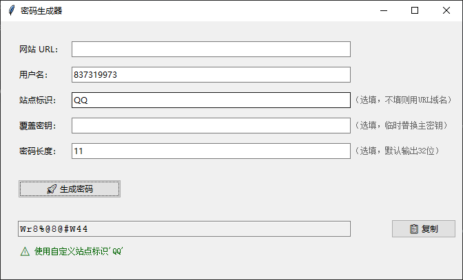

# 🔐 确定性密码生成器 (Deterministic Password Generator)


>⚠️【使用须知】你的 ~/.genpass_secret密钥文件是你所有密码的安全根基。​
切勿上传至网盘、GitHub、论坛或任何网络公开场所！​ 一旦泄露，攻击者可推算你所有派生密码。

一款基于**“域名/站点标识 + 用户名 + 本地主密钥 + 可选长度”**生成稳定强密码的工具。忘记密码时，凭记忆和本地密钥可一键找回，同时避免密钥泄露带来的撞库风险。

> ✅ 新增特性：支持指定密码长度（8-128位），自动保证大写/小写/数字/特殊符号齐全，适配各类网站密码策略。

------

## 📋 软件特点

- **确定性恢复**：同一组输入（URL/站点ID、用户名、本地Secret、长度）始终产生相同密码。
- **长度可控**：可生成8-128位密码，强制包含四类字符，适配严格密码策略。
- **安全隔离**：本地主密钥仅存于你的设备，攻击者无法仅凭公开信息推算密码。
- **开箱即用**：支持打包为单文件EXE，无需安装Python，双击即用。

------

## 🛡️ 安全模型

```markdown
密码 = HMAC-SHA256( 密钥+长度, 站点标识:用户名 ) → 轮询分配字符集 → 固定长度输出
```

- **长度隔离**：不同长度密码相互独立，无法由短推长。
- **符号保证**：输出必含大写字母、小写字母、数字和特殊符号（`@!#$%&*+-=?`）。
- **攻击门槛**：需同时掌握你的本地 `~/.genpass_secret`文件才能破解。

------

## 📦 项目结构

```text
.
├── core.py          # PasswordCore 核心引擎（密钥/哈希/派生）
├── cli.py           # 命令行接口
├── gui.py           # 图形界面
├── requirements.txt # 仅需 pyinstaller（打包用）
└── README.md
```

------

## 🚀 快速开始

> ⚠️ **操作前须知**：生成的密钥文件将保存到你的本地个人目录，请确保你不会无意中将它同步到云端。

### 1. 源码模式（开发者）

```bash
# 克隆/下载三个.py文件
python gui.py              # 启动图形版
python cli.py -u example.com -n user01 -l 16  # 命令行生成16位密码
```

### 2. 打包分发（终端用户免安装）

```bash
# 打包GUI（需先 pip install pyinstaller）
pyinstaller --onefile --noconsole --name GenPass-GUI gui.py
# 生成 dist/GenPass-GUI.exe，发给Windows用户双击运行
```

------

## 🖥️ GUI 图形界面

启动后界面示意（文字模拟）：



### 字段说明

- **网站 URL**：必填，自动提取域名（如 `service.com`）。

- **用户名**：必填，区分账号。

- **站点标识**：选填。填写则忽略URL域名，用于非网站密码生成。

- **覆盖密钥**：选填，临时替换主密钥。

- **密码长度**：选填（8-128）。留空则输出全长（约32位）。

- **生成密码**：点击后下方显示结果，右侧【📋 复制】一键粘贴。

### 首次运行

程序检测无密钥文件时，弹出向导页要求设置12位以上主密钥，保存后进入主界面。

------

## ⌨️ CLI 命令行

适合自动化、远程或批量调用。

### 语法

```bash
python cli.py -u <URL> -n <USERNAME> [-s SITE_ID] [-l LENGTH] [--raw-secret TEMP_KEY]
```

### 示例

```bash
# 生成16位密码（符号齐全）
python cli.py -u "https://my-site.com" -n alice -l 16

# 显式站点标识 + 20位密码
python cli.py -n dev01 -s company_site -l 20

# 首次初始化密钥（一次性）
python cli.py --init-secret "Your_Master_Secret_Here"
```

### 输出示例

```markdown
站点标识: company_site
最终密码: Ga7?E%8siso-o8-r%kS=
```

------

## ⚙️ 密码长度算法说明

指定长度（如 `-l 16`）时，采用**HMAC-SHA256(密钥+长度, 站点+用户)**生成种子流，按顺序轮询四类字符池：

- **大写**：`ABCDEFGHJKLMNPQRSTUVWXYZ`（去I,O）

- **小写**：`abcdefghijkmnopqrstuvwxyz`（去l）

- **数字**：`23456789`（去0,1）

- **特殊**：`@!#$%&*+-=?`

前4位强制各类型1次，后续按种子选择，最后补齐未出现的类型，确保**任意长度均含四类字符**。


------

## ⚠️ 安全提醒

1. **备份密钥**：`~/.genpass_secret`丢失将无法找回密码，建议加密备份。

2. **防泄露**：切勿上传密钥文件到网盘、GitHub等公开处。

3. **长度建议**：多数系统接受16-20位，个别旧系统可能需要调整特殊符号集（修改 `core.py`的 `special`变量）。

------

## 📝 许可证

MIT License，可自由修改分发。**作者不对密钥保管不当造成的损失承担责任。**